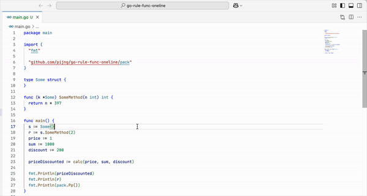
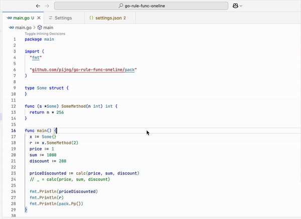

# Go SSA Explorer

**Go SSA Explorer** lets you visualize the output of Go’s SSA compiler pass. It shows the genssa of your code, including inlining decisions, helping you understand how the Go compiler transforms your code.

---

## Demos

**SSA form demo**

**Inlay hints with inlining decisions demo**

---

## Features

- **Visualize SSA for any function or method**
  Enter a function or method name (e.g., `package.FunctionName` or `(*Type).MethodName`) and see its SSA form.

- **Supports inlining analysis**
  See which functions are inlined by the compiler and how Go transforms your code internally.
  This feature is supported both in the SSA form and directly in the **source code** using inlay hints.
  Inlay hints can be toggled either via the “Toggle inlining decisions” command shown at the very top of the file, or with the keyboard shortcut:

  - Windows/Linux: `Ctrl+Alt+I`
  - macOS: `Cmd+Alt+I`

- **Hot-reload on file save**
  Automatically refresh the SSA visualization and inlining decisions when you save your Go files.

---

## Usage

1. Open a Go project in VSCode.
2. Open the **Command Palette** (`Ctrl+Shift+P` or `Cmd+Shift+P` on macOS).
3. Run **Go SSA Explorer: Show SSA**.
4. Enter the function or method name when prompted:
